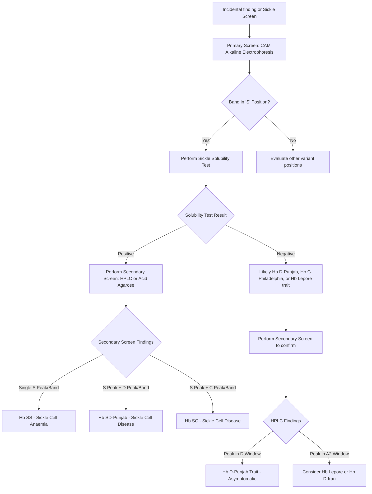

# Dr Barbra J Haematology Study Engine: Haemoglobin D Variants

*Extracted and structured from Variant Haemoglobins by Barbara J. Bain et al.*

## 1. Topic Summary: Haemoglobin D Variants

**Elevator Summary:** 
Haemoglobin D variants, particularly Hb D-Punjab (also known as D-Los Angeles), are beta-globin chain variants that are generally asymptomatic in heterozygous and homozygous states. However, their primary clinical significance lies in their ability to interact adversely with Haemoglobin S, leading to a severe form of sickle cell disease. Accurate laboratory identification is critical as Hb D-Punjab co-migrates with Hb S on alkaline cellulose acetate electrophoresis, necessitating secondary testing methods like acid agarose, IEF, or HPLC.

**Consultant Handover Summary:**
*   **Definition:** Hb D variants are a group of structural haemoglobin variants, with Hb D-Punjab (β121 Glu → Gln) being the most common and clinically significant.
*   **Epidemiology:** Hb D-Punjab is prevalent in NW India (Gujeratis, Sikhs), Pakistan, and individuals of African ancestry; it is the most common variant in the English population (notably Norfolk).
*   **Clinical Presentation:** Heterozygotes (Hb AD) and homozygotes (Hb DD) are asymptomatic with normal red cell indices.
*   **Key Interaction:** Co-inheritance with Hb S (Hb SD-Punjab) results in symptomatic sickle cell disease, as severe as Hb SS.
*   **Other D Variants:** Include Hb D-Iran (β22 Glu → Gln), Hb D-Ouled Rabah (β19 Asn → Lys), and Hb Dhofar (β58 Pro → Arg).
*   **Diagnostic Pitfall:** Hb D-Punjab moves with Hb S on alkaline cellulose acetate (CAM). Relying solely on CAM + sickle solubility test risks misdiagnosing Hb SD-Punjab as Hb SS.
*   **Confirmatory Testing:** At least two techniques are required. On acid agarose, Hb D-Punjab moves with/near Hb A. On IEF and HPLC, it separates from Hb S.
*   **HPLC Windows:** On Bio-Rad Variant II, Hb D-Punjab falls in the D window (3.9-4.3 min), while Hb D-Iran falls in the A2 window (3.3-3.9 min).
*   **Hb D-Iran:** Benign variant; does not interact adversely with Hb S.
*   **Hb Dhofar:** Often co-inherited with a second β29 mutation in Omani populations, leading to reduced synthesis (thalassaemic phenotype) and raised A2.

---

## 2. Detailed Teaching Summary

### Pathophysiology and Mechanisms
Haemoglobin D variants are characterized by structural mutations, mostly in the β-globin chain. 
*   **Hb D-Punjab (D-Los Angeles):** Results from the substitution of glutamine for glutamic acid at position 121 of the β chain (β121 Glu → Gln). The mutation does not affect the stability or oxygen affinity of the haemoglobin molecule significantly, which is why heterozygotes and homozygotes are asymptomatic. However, the specific structural change at β121 facilitates the polymerization of Hb S when the two variants are co-inherited, leading to sickling.
*   **Hb D-Iran:** Results from β22 Glu → Gln. Unlike D-Punjab, it does not interact adversely with Hb S.
*   **Hb D-Ouled Rabah:** Results from β19 Asn → Lys. It is a benign variant.
*   **Hb Dhofar (Yukuhashi):** Results from β58 Pro → Arg. Interestingly, cases from Oman often have a linked second mutation at β29 (C→T) which creates a new splice site, reducing synthesis to 8-22% and acting like a mild β-thalassaemia allele.

### Diagnostic Pathways and Pitfalls
The diagnosis of Hb D variants is a classic example of why multi-modal haemoglobinopathy screening is essential.

| Modality | Hb D-Punjab | Hb D-Iran | Hb S (for comparison) |
| :--- | :--- | :--- | :--- |
| **CAM (Alkaline pH 8.5)** | Co-migrates with Hb S | Co-migrates between S and A | S position |
| **Acid Agarose (pH 6.2)** | Co-migrates with Hb A (slightly anodal) | Co-migrates with Hb A | S position |
| **IEF** | Separates from S | Runs near A2 | S position |
| **HPLC (Bio-Rad Variant II)** | D-window (3.9-4.3 min) | A2-window (3.3-3.9 min) | S-window (4.3-4.7 min) |

**The Major Diagnostic Pitfall:** 
If a laboratory uses only cellulose acetate electrophoresis (CAM) as a primary screen, Hb D-Punjab and Hb S will appear as a single band. If the patient is a compound heterozygote (Hb SD-Punjab), they will have a positive sickle solubility test. The combination of a single "S" band on CAM and a positive solubility test can easily lead to a misdiagnosis of Sickle Cell Anaemia (Hb SS) instead of Hb SD-Punjab. 

**Resolution:** 
HPLC or acid agarose easily resolves this. On HPLC, Hb SD-Punjab will show two distinct peaks in the S and D windows, usually in roughly equal proportions.

---

## 3. Diagnostic Algorithm

---

## 4. Complete Atlas of HbD Cases from Dr Barbra J

The following table catalogues every case in the Variant Haemoglobins atlas that features a Haemoglobin D variant, either as the primary finding or as a control lane. Cases are colour-coded in the original text: green indicates a clinically benign state, while pink/red indicates a clinically significant condition.

| Atlas Case | Variant | Genotype | Clinical Significance | Key Notes |
| :--- | :--- | :--- | :--- | :--- |
| **167** | Hb D-Iran | β22 (Glu → Gln) heterozygote | Benign | Normal stability; does not interact with Hb S; no known clinical significance; peak at retention time 2.02 on Variant II likely represents glycated D-Iran |
| **168** | Hb D-Iran + β0 thalassaemia | Compound heterozygote for β22 (Glu → Gln) and β0 thal (IVS-1-5 G→C) | Clinically significant (β0 thal component) | D-Iran itself is benign; the clinical significance derives entirely from the β0 thalassaemia mutation |
| **169** | Hb D-Iran + Hb C | Compound heterozygote for Hb C β6 (Glu → Lys) and Hb D-Iran β22 (Glu → Gln) | Benign (D-Iran component) | Double heterozygote; Hb C is the clinically relevant variant (mild haemolysis in homozygotes, interaction with Hb S) |
| **175** | Hb D-Ouled Rabah | β19 (Asn → Lys) heterozygote | Benign | Peak at 2.10 on Bio-Rad Variant likely represents glycated variant; normal stability; no known clinical significance |
| **188** | Hb Dhofar (Yukuhashi) | β58 (Pro → Arg) heterozygote | Complex | Omani cases have linked β29 (C→T) mutation creating new splice site; reduced synthesis (8-22%); raised A2; contributes to thalassaemia intermedia in compound heterozygotes; Japanese cases lack this second mutation and are asymptomatic (variant 40-45%) |
| **190** | Hb D-Punjab | β121 (Glu → Gln) heterozygote | Benign (trait) | Also known as Hb D-Los Angeles; mobility on acid agarose sometimes slightly anodal to Hb A; heterozygotes are asymptomatic; causes sickle cell disease when co-inherited with Hb S |
| **191** | Hb D-Punjab | β121 (Glu → Gln) homozygote | Benign | Clinically significant only because of potential interaction with Hb S; F 0.6%, A2 1.6% |
| **192** | Hb D-Punjab + Hb E | Compound heterozygote for β121 (Glu → Gln) and β26 (Glu → Lys) | Asymptomatic | Both variants are individually clinically significant but this compound state is asymptomatic; RBC 5.99, Hb 134, MCV 69, MCH 22.4 |
| **193** | Hb D-Punjab + Hb S | Compound heterozygote for β6 (Glu → Val) and β121 (Glu → Gln) | **Severe sickle cell disease** | Clinical significance similar to sickle cell anaemia (Hb SS); F 7.3%, A2 2.7%; quantitation inaccurate due to poor baseline |

In addition to these primary cases, Hb D-Punjab and Hb D-Iran appear as **control lane samples** in numerous other atlas cases (e.g., cases 176, 177, 178, 179, 180 and others), where they serve as reference points for electrophoretic and HPLC comparisons.

---

## 5. High-Yield Clinical Cases

### Case 1: The Misleading Sickle Screen (Based on Dr Barbra J's Atlas Case 193)
**Clinical Stem:** A 24-year-old man of Indian descent presents to the emergency department with severe bone pain in his legs and back, consistent with a vaso-occlusive crisis. His full blood count shows a mild normocytic anaemia. Alkaline cellulose acetate electrophoresis shows a single band in the 'S' position. A sickle solubility test is positive. 

**What I would do on the ward round:**
I would treat this as an acute sickle cell crisis with aggressive hydration, analgesia (following the WHO pain ladder, likely requiring opiates), and oxygen if saturations are low. However, I would immediately question the presumptive diagnosis of Hb SS given his Indian heritage, where Hb D-Punjab is highly prevalent. I would request an urgent HPLC or acid agarose electrophoresis to distinguish between Hb SS and Hb SD-Punjab. I would also check his partner's haemoglobinopathy status if they are planning a family, as genetic counselling is paramount.

**MCQs:**
1.  **Which of the following techniques is essential to differentiate between Hb SS and Hb SD-Punjab?**
    A) Alkaline cellulose acetate electrophoresis
    B) Sickle solubility test
    C) Acid agarose gel electrophoresis
    D) Full blood count and film
    E) Reticulocyte count
    *Answer: C. Hb D-Punjab and Hb S co-migrate on alkaline cellulose acetate, and both conditions will yield a positive sickle solubility test. Acid agarose or HPLC is required to separate them.*

2.  **What is the clinical significance of being a heterozygote for Hb D-Punjab (Hb AD)?**
    A) Mild microcytic anaemia
    B) Chronic haemolysis
    C) Asymptomatic, but risk of having a child with sickle cell disease if partner has Hb S
    D) Predisposition to vaso-occlusive crises at high altitudes
    E) Elevated Hb A2 levels
    *Answer: C. Hb D-Punjab trait is clinically silent with normal red cell indices. The primary significance is genetic counselling regarding the risk of Hb SD-Punjab disease in offspring.*

### Case 2: The Elevated A2 Conundrum (Based on Dr Barbra J's Atlas Case 167 & 188)
**Clinical Stem:** A 30-year-old asymptomatic woman undergoes antenatal screening. Her FBC is normal. HPLC shows an abnormal peak in the A2 window, with a quantified A2 level of 45%. 

**Viva Questions:**
1.  **What are the differential diagnoses for a large variant peak in the A2 window on HPLC?**
    *Model Answer:* The differential includes Hb E, Hb Lepore, Hb D-Iran, Hb Osu-Christiansborg, and Hb Korle-Bu. It can also represent post-translationally modified Hb S if the patient has sickle cell trait.
2.  **How would you differentiate Hb E from Hb D-Iran in this patient?**
    *Model Answer:* I would use a secondary technique. On acid agarose gel electrophoresis, Hb E and Hb D-Iran both run with Hb A, which doesn't help. However, on IEF, they can be distinguished. Alternatively, Hb E trait often presents with mild microcytosis, whereas Hb D-Iran trait typically has normal red cell indices. Furthermore, Hb E is highly prevalent in Southeast Asia, while D-Iran is more common in Middle Eastern populations.
3.  **If this patient had Hb Dhofar instead, what unique genetic feature might be present if she were from Oman?**
    *Model Answer:* Cases of Hb Dhofar from Oman often have a linked second mutation at β29 that creates a new splice site. This results in reduced synthesis of the variant chain, acting like a mild β-thalassaemia, which leads to a raised Hb A2 level and can contribute to thalassaemia intermedia if co-inherited with another thalassaemia mutation.

---

## 6. Infographic Plan: Demystifying Haemoglobin D

**Title:** The D-Variants: More Than Meets the Eye
**Subtitle:** Navigating Hb D-Punjab and its mimics in the laboratory

**Layout Suggestions:**
*   **Top Row (The Basics):** 
    *   Hb D-Punjab is the most common D variant (β121 Glu → Gln).
    *   Prevalent in NW India, Pakistan, and African populations.
    *   Trait (Hb AD) is completely asymptomatic.
*   **Middle Row (The Danger Zone):**
    *   *Visual:* Warning sign or Traffic Light (Red).
    *   Interaction with Hb S (Hb SD-Punjab) causes severe Sickle Cell Disease.
    *   Do NOT confuse Hb SD-Punjab with Hb SS.
*   **Bottom Row (The Lab Trap):**
    *   *Visual:* Simple flowchart or comparison table.
    *   CAM (Alkaline): Hb S and Hb D co-migrate.
    *   Acid Agarose / HPLC: Hb S and Hb D separate.
    *   *Golden Rule:* Always use TWO techniques for variant identification!

---

## 7. 10 Key Exam Pearls

1.  **Hb D-Punjab = Hb D-Los Angeles.** They are the same variant (β121 Glu → Gln).
2.  **Hb SD-Punjab is a severe sickling disorder.** It is clinically indistinguishable from homozygous sickle cell anaemia (Hb SS).
3.  **Hb D-Punjab co-migrates with Hb S** on alkaline cellulose acetate electrophoresis.
4.  **A positive sickle solubility test + an "S" band on CAM does NOT equal Hb SS.** It could be Hb SD-Punjab or Hb S/Lepore.
5.  **Acid agarose gel electrophoresis or HPLC** must be used to separate Hb S from Hb D-Punjab.
6.  **Hb D-Iran (β22 Glu → Gln) is benign.** It does not interact with Hb S to cause sickling.
7.  **Hb D-Iran co-migrates with Hb A2** on HPLC, whereas Hb D-Punjab has its own "D window".
8.  **Hb D-Punjab trait (Hb AD) has normal red cell indices.** If microcytosis is present, suspect co-existing alpha-thalassaemia.
9.  **Hb Dhofar (Yukuhashi)** in Omani populations is often linked to a β29 mutation causing a thalassaemic phenotype.
10. **Carryover on HPLC** (e.g., from a preceding Hb SS sample) can cause artifactual peaks and misdiagnosis; always review the chromatogram baseline and previous samples.

---
*Evidence Note: The content above is derived directly from Dr Barbra J's Variant Haemoglobins. For current practice regarding the management of sickle cell disease (including Hb SD-Punjab), refer to the latest BSH (British Society for Haematology) guidelines on the management of acute sickle cell crises.*
