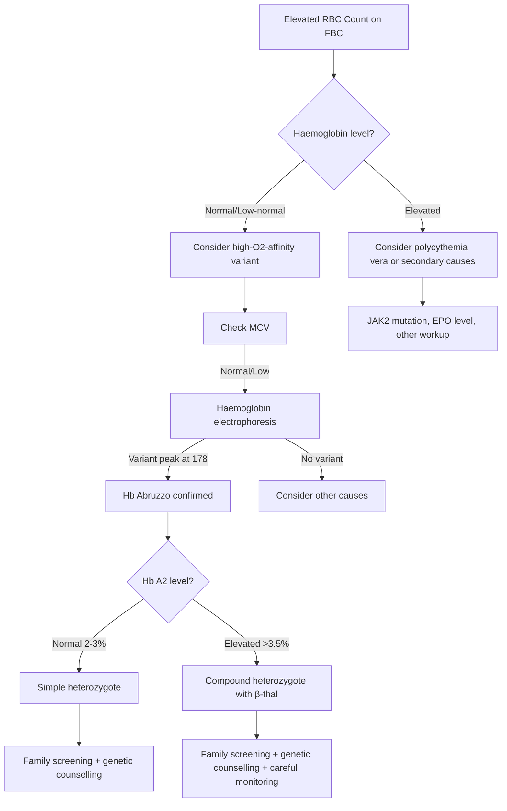

# Hb Abruzzo: Comprehensive Clinical Teaching Document
## A High-Oxygen-Affinity Haemoglobin Variant

**Prepared by: Dr Abdul Mannan (Blood Doctor)**
**Date: February 11, 2026**
**Purpose: FRCPath/FCPS Teaching & Clinical Reference**

---

## 📋 Executive Summary

**Hb Abruzzo** is a rare beta-globin variant causing **erythrocytosis** through increased oxygen affinity. The mutation β143(H21) His→Arg affects a critical residue in the 2,3-DPG binding site, shifting the oxygen-haemoglobin dissociation curve leftward and impairing oxygen delivery to tissues.

### Key Clinical Points
- **Inheritance**: Autosomal dominant (heterozygous state)
- **Clinical presentation**: Incidental erythrocytosis, usually asymptomatic
- **Laboratory hallmark**: Elevated RBC count, normal/low MCV, normal haemoglobin
- **Diagnostic clue**: Electrophoresis shows variant peak in Z(F) zone at position 178
- **Clinical risk**: Compound heterozygosity with β-thalassemia causes marked erythrocytosis
- **Management**: Usually conservative; avoid unnecessary phlebotomy

---

## 🧬 Molecular Genetics

### Mutation Details
| Feature | Detail |
|---------|--------|
| **Gene** | HBB (beta-globin) |
| **Mutation** | c.431A>G |
| **Protein change** | β143(H21) His→Arg |
| **Position** | C-terminal region, H21 helix |
| **HGVS nomenclature** | HBB:c.431A>G |

### Pathophysiology

The β143 histidine residue normally:
1. **Binds 2,3-DPG** in the central cavity between β-chains
2. **Stabilizes the deoxy (T) conformation** of haemoglobin
3. **Reduces oxygen affinity** to facilitate oxygen release in tissues

When replaced by **arginine**:
- Positive charge disrupts 2,3-DPG binding
- Haemoglobin remains in **high-affinity oxy (R) conformation**
- Oxygen is held more tightly, impairing tissue oxygen delivery
- Compensatory **erythrocytosis** develops to maintain tissue oxygenation

---

## 🔬 Laboratory Features

### Capillary Electrophoresis Pattern
```
Haemoglobin Fractions (Heterozygous State):
├─ Hb A: 61.4%
├─ Hb Abruzzo: 35.5% ← Diagnostic peak
├─ Hb A2: 2.5% (normal)
└─ Denatured Hb: 0.6%

Migration zone: Z(F)
Migration position: 178
```

### Complete Blood Count
| Parameter | Finding | Interpretation |
|-----------|---------|----------------|
| **RBC count** | ↑ Elevated | Primary feature |
| **Haemoglobin** | Normal | Compensated |
| **MCV** | Normal to low | Microcytic tendency |
| **MCH** | Normal to low | Reflects MCV |
| **Blood film** | No specific findings | Non-diagnostic |

### Functional Studies
| Test | Hb Abruzzo | Hb A (Normal) |
|------|------------|---------------|
| **Oxygen affinity** | ↑ Increased | Normal |
| **P50** | Decreased | 26-28 mmHg |
| **Bohr effect** | Reduced | Normal |
| **Cooperativity (n)** | Reduced | 2.7-3.0 |
| **2,3-DPG response** | Abnormal | Normal |

---

## 📚 Evidence Base: Key Publications

According to PubMed, the following landmark studies defined Hb Abruzzo's functional properties:

### 1. Original Description (1972)
**Tentori L et al.** First identified Hb Abruzzo in Italian families.
[DOI: 10.1016/0009-8981(72)90241-0](https://doi.org/10.1016/0009-8981(72)90241-0)
PMID: 5031790

### 2. Functional Characterization (1975)
**Bonaventura C et al.** Demonstrated consequences of altering the 2,3-DPG binding site.
Key finding: "Hemoglobin Abruzzo has increased oxygen affinity and reduced heme-heme interaction in the absence of organic or inorganic phosphate cofactors."
[DOI: S0021-9258(19)41061-2](https://www.jbc.org/)
PMID: 239943

**Bonaventura J et al.** Characterized allosteric interactions in isolated β-chains.
Key finding: "Stripped beta chains isolated from hemoglobin Abruzzo have much higher oxygen affinity than beta chains isolated from HbA."
[DOI: S0021-9258(19)41062-4](https://www.jbc.org/)
PMID: 1158862

### Clinical Context
Similar high-affinity variants (e.g., Hb San Diego, Hb Ohio) also cause erythrocytosis through impaired oxygen release. These variants highlight the critical role of C-terminal β-chain residues in haemoglobin function.

---

## 🎯 Clinical Presentation

### Typical Patient Profile
- **Demographics**: Caucasian (Italian/Italian-American ancestry most common)
- **Age at diagnosis**: Any age; often incidental finding
- **Symptoms**: Usually **asymptomatic**
- **Discovery**: Routine blood test showing elevated RBC count

### Homozygous State (Rare)
- Only one case reported (Italian-American family)
- More pronounced erythrocytosis
- Similar clinical tolerance

### Compound Heterozygotes
⚠️ **CRITICAL**: Hb Abruzzo + β-thalassemia trait causes:
- **Marked erythrocytosis** (more severe than simple heterozygote)
- Microcytosis (from thalassemia)
- Potential for confusion with polycythemia vera

---

## 💡 Clinical Pearls

### Diagnostic Pearls
1. **Incidental erythrocytosis** with normal haemoglobin suggests high-oxygen-affinity variant
2. **Normal/low MCV** helps distinguish from polycythemia vera (usually normal MCV)
3. **Capillary electrophoresis** is diagnostic—shows distinct peak at position 178
4. **Family history** of "high red cell count" supports inherited variant
5. **Italian ancestry** increases pre-test probability for Hb Abruzzo

### Management Pearls
1. **No treatment needed** in isolated heterozygous state
2. **Avoid phlebotomy**—erythrocytosis is compensatory, not pathological
3. **Genetic counselling** recommended for family planning
4. **Screen family members** to identify affected relatives
5. **Document diagnosis clearly** to prevent future unnecessary investigations

### Prognostic Pearls
1. **Benign condition** with normal life expectancy
2. **No thrombotic risk** (unlike polycythemia vera)
3. **No increased bleeding risk**
4. **Stable over lifetime**—erythrocytosis doesn't worsen

---

## ⚠️ Diagnostic Pitfalls

### Pitfall 1: Misdiagnosing as Polycythemia Vera
❌ **Error**: Treating asymptomatic erythrocytosis with phlebotomy
✅ **Correct approach**:
- Check **JAK2 V617F mutation** (negative in Hb Abruzzo)
- Measure **serum EPO** (low/normal in Hb Abruzzo, often low in PV)
- Perform **haemoglobin electrophoresis**

### Pitfall 2: Missing Compound Heterozygote State
❌ **Error**: Assuming simple Hb Abruzzo in patient with marked erythrocytosis
✅ **Correct approach**:
- Check **Hb A2** (elevated if β-thalassemia trait present)
- Consider **β-globin gene sequencing**
- Review **family history** carefully

### Pitfall 3: Assuming Thalassemia from Low MCV
❌ **Error**: Diagnosing β-thalassemia trait based on microcytosis alone
✅ **Correct approach**:
- Electrophoresis distinguishes Hb Abruzzo from thalassemia
- Hb Abruzzo: variant peak + normal Hb A2
- β-thalassemia: elevated Hb A2, no variant peak

### Pitfall 4: Over-investigating Asymptomatic Patients
❌ **Error**: Ordering bone marrow biopsy for "unexplained" erythrocytosis
✅ **Correct approach**:
- Haemoglobin electrophoresis is first-line investigation
- Bone marrow biopsy **not indicated** if variant identified

---

## 📊 Diagnostic Algorithm



---

## 🧪 Case-Based MCQs (FRCPath Part 2 Standard)

### Question 1: Clinical Recognition
A 32-year-old Italian woman is referred for investigation of erythrocytosis found on a routine medical examination. Her RBC count is 6.2 × 10¹²/L, haemoglobin 138 g/L, MCV 78 fL, and she has no symptoms. Haemoglobin electrophoresis shows Hb A 61%, abnormal fraction 35%, and Hb A2 2.4%. What is the most likely diagnosis?

A. Polycythemia vera
B. β-thalassemia trait
C. Hb Abruzzo
D. Secondary erythrocytosis
E. Iron deficiency with reactive erythrocytosis

**✓ Answer: C. Hb Abruzzo**

**Explanation**: The patient has asymptomatic erythrocytosis with normal haemoglobin (tissue hypoxia drives RBC production), low-normal MCV, and a clear variant haemoglobin peak (35%) with normal Hb A2. This electrophoretic pattern is characteristic of a high-oxygen-affinity variant like Hb Abruzzo. Polycythemia vera would typically show elevated haemoglobin. β-thalassemia trait shows elevated Hb A2 (>3.5%), not a variant peak. Secondary erythrocytosis would not produce a variant haemoglobin band.

**Learning Point**: High-oxygen-affinity variants cause **compensatory erythrocytosis** with normal or only slightly elevated haemoglobin, distinguishing them from polycythemia vera.

**Difficulty**: ⭐⭐⭐ (FRCPath Part 2)
**Topic Tags**: #HbVariants #Erythrocytosis #Electrophoresis

---

### Question 2: Molecular Mechanism
Which molecular feature explains the increased oxygen affinity of Hb Abruzzo?

A. Enhanced α1β1 interface stability
B. Disrupted 2,3-DPG binding
C. Impaired heme iron coordination
D. Increased methemoglobin formation
E. Enhanced Bohr effect

**✓ Answer: B. Disrupted 2,3-DPG binding**

**Explanation**: Hb Abruzzo has β143 His→Arg substitution. The β143 histidine normally participates in 2,3-DPG binding in the central cavity. Replacing histidine with arginine disrupts this binding, preventing 2,3-DPG from stabilizing the low-affinity deoxy (T) conformation. As a result, haemoglobin remains in the high-affinity oxy (R) conformation, holding oxygen more tightly. The α1β1 interface is not directly affected. Heme coordination is normal. The Bohr effect is actually *reduced* in Hb Abruzzo, not enhanced.

**Learning Point**: Mutations at β143 (and surrounding C-terminal residues) impair 2,3-DPG binding and shift haemoglobin toward the **R state**, increasing oxygen affinity.

**Difficulty**: ⭐⭐⭐⭐ (Advanced)
**Topic Tags**: #HbStructure #OxygenAffinity #2,3-DPG

---

### Question 3: Compound Heterozygote Recognition
A 28-year-old man with known Hb Abruzzo presents with an RBC count of 7.8 × 10¹²/L, haemoglobin 152 g/L, MCV 68 fL, and Hb A2 4.2%. His father has Hb Abruzzo, and his mother has β-thalassemia trait. What is the most likely explanation for his marked erythrocytosis?

A. Polycythemia vera supervening on Hb Abruzzo
B. Iron deficiency exacerbating Hb Abruzzo
C. Compound heterozygosity for Hb Abruzzo and β-thalassemia
D. Homozygous Hb Abruzzo
E. Acquired erythrocytosis from renal tumor

**✓ Answer: C. Compound heterozygosity for Hb Abruzzo and β-thalassemia**

**Explanation**: The combination of Hb Abruzzo (high oxygen affinity) and β-thalassemia trait (reduced β-chain synthesis) creates a **synergistic effect**. The relative increase in Hb Abruzzo proportion (due to reduced normal β-chain) worsens tissue hypoxia, driving more pronounced erythrocytosis. Elevated Hb A2 (4.2%) confirms β-thalassemia trait. Microcytosis (MCV 68) also supports thalassemia. Polycythemia vera would require JAK2 mutation and wouldn't explain elevated Hb A2. Homozygous Hb Abruzzo would not show elevated Hb A2.

**Learning Point**: Compound heterozygosity for a high-oxygen-affinity variant and β-thalassemia causes **additive** erythrocytosis worse than either condition alone.

**Difficulty**: ⭐⭐⭐⭐ (Advanced)
**Topic Tags**: #CompoundHeterozygote #Thalassemia #Erythrocytosis

---

### Question 4: Investigation Strategy
Which investigation is most useful to differentiate Hb Abruzzo from polycythemia vera in a patient with erythrocytosis?

A. Bone marrow biopsy
B. JAK2 V617F mutation
C. Serum erythropoietin level
D. Haemoglobin electrophoresis
E. Red cell mass study

**✓ Answer: D. Haemoglobin electrophoresis**

**Explanation**: Haemoglobin electrophoresis is the **most specific** test—it directly identifies Hb Abruzzo by demonstrating a variant peak. JAK2 V617F is useful (positive in ~95% of PV, negative in Hb Abruzzo) but doesn't establish the diagnosis of Hb Abruzzo. Serum EPO is low-normal in both Hb Abruzzo (appropriately low for elevated RBC) and PV, so it's not discriminatory. Bone marrow biopsy is invasive and unnecessary if electrophoresis confirms a variant. Red cell mass study confirms true erythrocytosis but doesn't differentiate causes.

**Learning Point**: **Haemoglobin electrophoresis** should be performed early in the workup of unexplained erythrocytosis to identify haemoglobin variants.

**Difficulty**: ⭐⭐⭐ (FRCPath Part 2)
**Topic Tags**: #Investigations #Erythrocytosis #Electrophoresis

---

### Question 5: Management Decision
A 45-year-old asymptomatic woman is diagnosed with Hb Abruzzo. Her RBC count is 6.0 × 10¹²/L, haemoglobin 140 g/L, and haematocrit 0.42. What is the most appropriate management?

A. Therapeutic phlebotomy to haematocrit <0.45
B. Low-dose aspirin for thromboprophylaxis
C. Observation with no intervention
D. Hydroxycarbamide to reduce RBC count
E. Referral to transplant center

**✓ Answer: C. Observation with no intervention**

**Explanation**: Hb Abruzzo is a **benign condition** requiring no treatment. The erythrocytosis is *compensatory* for impaired oxygen delivery and should not be suppressed. Phlebotomy would worsen tissue hypoxia and is contraindicated. There is **no thrombotic risk** (unlike polycythemia vera), so aspirin is not indicated. Hydroxycarbamide is used in PV, not haemoglobin variants. Transplant is completely inappropriate. The patient needs **reassurance, genetic counseling, and family screening** only.

**Learning Point**: High-oxygen-affinity variants require **no treatment**—the erythrocytosis is physiologically appropriate and should not be "corrected."

**Difficulty**: ⭐⭐ (Moderate)
**Topic Tags**: #Management #Erythrocytosis #HighO2Affinity

---

## 🎓 Viva Scenarios for Oral Examination

### Viva Scenario 1: First Encounter with Erythrocytosis

**Examiner Opening**: "A 35-year-old Italian man is referred by his GP with an elevated red cell count found on a health check. He's completely well. His FBC shows RBC 6.5 × 10¹²/L, Hb 145 g/L, MCV 80 fL. What's your approach?"

**Expected Candidate Response**:
- History: Symptoms of polycythemia (headache, pruritus, erythromelalgia), smoking, sleep apnoea, cardiac/respiratory disease, family history
- Examination: Splenomegaly, plethora, signs of hypoxic lung disease
- Initial investigations: Repeat FBC, serum EPO, JAK2 V617F mutation, **haemoglobin electrophoresis**

**Examiner Follow-up**: "Good. His JAK2 is negative, EPO is low-normal, and electrophoresis shows a variant peak at 35%. What's your differential now?"

**Expected Response**:
- High-oxygen-affinity haemoglobin variant (most likely)
- Specific examples: Hb Chesapeake, Hb Abruzzo, Hb Yakima
- Next step: Identify specific variant by migration position, molecular sequencing

**Examiner Follow-up**: "The variant migrates at position 178 in the Z(F) zone, and Hb A2 is 2.5%. What's the diagnosis?"

**Expected Response**:
- **Hb Abruzzo** (β143 His→Arg)
- Electrophoretic pattern matches
- Normal Hb A2 excludes β-thalassemia trait

**Examiner Follow-up**: "Explain the pathophysiology."

**Expected Response**:
- β143 histidine normally binds 2,3-DPG
- Arginine substitution disrupts 2,3-DPG binding
- Haemoglobin shifts to high-affinity (R) state
- Impaired oxygen release to tissues
- Compensatory erythrocytosis develops
- EPO-driven RBC production increases to maintain tissue oxygenation

**Examiner Final Question**: "How do you manage him?"

**Expected Response**:
- **No treatment required**—benign condition
- Avoid phlebotomy (worsens tissue hypoxia)
- Reassurance and education
- Genetic counseling
- Family screening
- Document diagnosis to prevent future over-investigation

---

### Viva Scenario 2: Compound Heterozygote Challenge

**Examiner Opening**: "You see a 40-year-old woman with RBC 7.0 × 10¹²/L, Hb 155 g/L, MCV 70 fL. Electrophoresis shows Hb Abruzzo 45%, Hb A 50%, Hb A2 4.0%. Why is her erythrocytosis more severe than typical Hb Abruzzo?"

**Expected Candidate Response**:
- Elevated Hb A2 (4.0%) indicates **β-thalassemia trait**
- Compound heterozygote: Hb Abruzzo + β-thalassemia
- Reduced normal β-chain synthesis increases **proportion** of Hb Abruzzo
- Higher percentage of high-affinity variant worsens tissue hypoxia
- Additive effect drives more pronounced erythrocytosis

**Examiner Follow-up**: "What's the clinical significance?"

**Expected Response**:
- More marked erythrocytosis than either condition alone
- May mimic polycythemia vera more closely
- Still benign—no treatment needed
- Important for family screening and genetic counseling
- Risk of recurrence in offspring

**Examiner Final Question**: "How would you counsel her about pregnancy?"

**Expected Response**:
- Generally well tolerated
- Monitor for excessive erythrocytosis during pregnancy
- Avoid unnecessary phlebotomy
- Partner should be tested for β-thalassemia carrier status
- Offspring risk depends on partner status

---

### Viva Scenario 3: Investigation Justification

**Examiner Opening**: "Your consultant says you should always do haemoglobin electrophoresis in young patients with unexplained erythrocytosis. Why?"

**Expected Candidate Response**:
- High-oxygen-affinity variants are **underdiagnosed**
- Polycythemia vera is rare in young patients (<40 years)
- Electrophoresis is non-invasive and inexpensive
- Identifies a specific cause, avoiding extensive workup
- Prevents inappropriate treatment (e.g., phlebotomy, cytoreduction)

**Examiner Follow-up**: "What if the electrophoresis is normal but you still suspect a variant?"

**Expected Response**:
- Some variants have **normal electrophoretic mobility**
- Consider **oxygen dissociation curve** (P50 measurement)
- Low P50 confirms high oxygen affinity
- Molecular sequencing may be needed for definitive diagnosis
- Examples of electrophoretically silent variants: Hb Andrew-Minneapolis, Hb Chesapeake

**Examiner Challenge**: "Is oxygen dissociation curve testing readily available?"

**Expected Response**:
- No—specialist test available in reference laboratories only
- Takes several weeks for results
- Clinical suspicion guides request
- Most variants *are* detectable by electrophoresis, so normal result makes high-affinity variant less likely

---

## 📽️ Teaching Slide Content (PowerPoint-Ready)

### Slide 1: Title Slide
**Title**: Hb Abruzzo: A High-Oxygen-Affinity Variant Causing Erythrocytosis
**Subtitle**: Understanding β143 Mutations and Clinical Implications
**Presenter**: Dr Abdul Mannan (Blood Doctor)
**Date**: February 11, 2026

**Speaker Note**: "Today we'll explore Hb Abruzzo, a fascinating example of how a single amino acid substitution disrupts haemoglobin function and causes compensatory erythrocytosis. This case illustrates fundamental principles of haemoglobin structure-function relationships."

---

### Slide 2: Learning Objectives
**Title**: What You'll Learn Today

- Recognize the clinical presentation of high-oxygen-affinity haemoglobin variants
- Explain the molecular mechanism underlying Hb Abruzzo's functional abnormality
- Interpret haemoglobin electrophoresis patterns
- Differentiate Hb Abruzzo from polycythemia vera
- Manage patients appropriately with no unnecessary interventions

**Speaker Note**: "By the end of this session, you should feel confident investigating a patient with unexplained erythrocytosis and recognizing when a haemoglobin variant is the cause."

---

### Slide 3: Hb Abruzzo at a Glance
**Title**: Quick Facts

| Feature | Detail |
|---------|--------|
| **Mutation** | β143 His→Arg (HBB:c.431A>G) |
| **Inheritance** | Autosomal dominant |
| **Origin** | Italian/Italian-American families |
| **Key abnormality** | Increased oxygen affinity |
| **Clinical finding** | Asymptomatic erythrocytosis |
| **Diagnosis** | Haemoglobin electrophoresis |
| **Management** | None required—benign condition |

**Speaker Note**: "Hb Abruzzo is one of several high-oxygen-affinity variants. The key is recognizing the pattern: incidental erythrocytosis in an otherwise well patient, often with Italian ancestry."

---

### Slide 4: The β143 Residue—A Critical Position
**Title**: Why Does This Mutation Matter?

**Normal β143 histidine**:
- Located at C-terminus of β-chain
- Part of 2,3-DPG binding pocket
- Stabilizes deoxy (T, low-affinity) conformation
- Allows oxygen release in tissues

**Mutant β143 arginine** (Hb Abruzzo):
- Disrupts 2,3-DPG binding
- Favors oxy (R, high-affinity) conformation
- Impairs oxygen release
- → Tissue hypoxia → Compensatory erythrocytosis

**Speaker Note**: "Think of 2,3-DPG as the 'release mechanism' for oxygen. In Hb Abruzzo, this mechanism is broken, so haemoglobin holds onto oxygen too tightly. The body responds by making more red cells to compensate."

---

### Slide 5: Oxygen Dissociation Curve
**Title**: Leftward Shift in Hb Abruzzo

```
[Diagram showing oxygen dissociation curve]
Normal Hb A: Sigmoidal curve, P50 = 26-28 mmHg
Hb Abruzzo: Curve shifted LEFT, P50 = ~18-20 mmHg

Interpretation:
- At any given PO2, Hb Abruzzo has higher saturation
- Less oxygen released at tissue PO2 (~40 mmHg)
- Tissue hypoxia despite normal arterial saturation
```

**Speaker Note**: "This leftward shift is the fundamental problem. Even though arterial oxygen saturation is normal, tissues don't get enough oxygen because haemoglobin won't let go of it. The body's solution? Make more red cells."

---

### Slide 6: Electrophoresis Pattern (Diagnostic Key)
**Title**: Recognizing Hb Abruzzo on Capillary Electrophoresis

**Typical Pattern (Heterozygote)**:
- **Hb A**: 60-65%
- **Hb Abruzzo**: 30-40% ← Diagnostic peak
- **Hb A2**: 2-3% (normal)
- **Migration zone**: Z(F)
- **Migration position**: 178

**Clinical Pearl**: The variant peak at ~35% is the key finding. Normal Hb A2 excludes β-thalassemia trait.

**Speaker Note**: "Electrophoresis is diagnostic. You'll see a clear second peak representing Hb Abruzzo. If Hb A2 is elevated, think about compound heterozygosity with β-thalassemia trait."

---

### Slide 7: Differential Diagnosis of Erythrocytosis
**Title**: How to Distinguish Hb Abruzzo from Other Causes

| Feature | Hb Abruzzo | Polycythemia Vera | β-Thalassemia Trait |
|---------|------------|-------------------|---------------------|
| **Haemoglobin** | Normal/High-normal | Elevated | Low-normal |
| **RBC count** | ↑↑ | ↑↑ | ↑ |
| **MCV** | Normal/Low | Normal | Low |
| **JAK2 V617F** | Negative | Positive (95%) | Negative |
| **Electrophoresis** | Variant peak | Normal | Elevated Hb A2 |
| **EPO** | Normal/Low-normal | Low | Normal |

**Speaker Note**: "The combination of normal haemoglobin, elevated RBC count, and a variant peak on electrophoresis clinches the diagnosis. JAK2 testing helps exclude PV."

---

### Slide 8: Compound Heterozygote Alert
**Title**: ⚠️ When Erythrocytosis is More Severe

**Scenario**: Hb Abruzzo + β-Thalassemia Trait

**Why is it worse?**
1. β-thalassemia reduces normal β-chain synthesis
2. Relative increase in Hb Abruzzo proportion (>40%)
3. More severe tissue hypoxia
4. Drives more pronounced erythrocytosis (RBC >7.0 × 10¹²/L)

**Clues**:
- Marked microcytosis (MCV <75 fL)
- Elevated Hb A2 (>3.5%)
- Hb Abruzzo fraction >40%

**Speaker Note**: "Always check Hb A2. If it's elevated, you're dealing with a compound heterozygote, which has more severe erythrocytosis than simple Hb Abruzzo."

---

### Slide 9: Management—Less is More
**Title**: What NOT to Do

**❌ DO NOT**:
- Perform phlebotomy (worsens tissue hypoxia)
- Prescribe cytoreductive therapy (unnecessary)
- Give aspirin (no thrombotic risk)
- Order bone marrow biopsy (not indicated)

**✅ DO**:
- Reassure patient—this is benign
- Explain pathophysiology
- Genetic counseling
- Family screening
- Document diagnosis clearly to prevent re-investigation

**Speaker Note**: "The biggest risk is over-treating. This is a benign, compensatory response. The worst thing you can do is phlebotomy, which makes the tissue hypoxia worse."

---

### Slide 10: Family Screening Approach
**Title**: Identifying Affected Relatives

**Who to screen**:
- First-degree relatives (parents, siblings, children)
- If planning pregnancy, test partner for β-thalassemia carrier status

**What to test**:
- FBC (looking for erythrocytosis)
- Haemoglobin electrophoresis (if RBC count elevated)

**Benefits**:
- Prevents unnecessary investigation in affected relatives
- Clarifies inheritance pattern
- Informs reproductive counseling

**Speaker Note**: "Family screening is important because other relatives may have undergone extensive investigation for unexplained erythrocytosis. Identifying the cause early prevents this."

---

### Slide 11: Key Takeaways
**Title**: What to Remember About Hb Abruzzo

1. **High-oxygen-affinity variant** due to β143 His→Arg mutation
2. **Impaired 2,3-DPG binding** → leftward O2 dissociation curve shift
3. **Asymptomatic erythrocytosis** with normal haemoglobin
4. **Electrophoresis** shows variant peak at position 178 (Z(F) zone)
5. **Benign condition**—no treatment required
6. **Avoid phlebotomy**—erythrocytosis is compensatory
7. **Screen family**—autosomal dominant inheritance

**Speaker Note**: "If you remember nothing else, remember this: unexplained erythrocytosis in a young, asymptomatic patient → do haemoglobin electrophoresis."

---

### Slide 12: Case-Based Learning
**Title**: Apply Your Knowledge

**Case**: 30-year-old Italian woman, RBC 6.3 × 10¹²/L, Hb 138 g/L, asymptomatic.

**Questions for discussion**:
1. What's your first investigation?
2. Electrophoresis shows variant at 35%. What now?
3. How do you manage her?
4. She's planning pregnancy—any concerns?

*[Interactive discussion with audience]*

**Speaker Note**: "Let's test what we've learned. What would you do next in this scenario? Think about the diagnostic pathway we've discussed."

---

### Slide 13: Further Learning Resources
**Title**: Want to Learn More?

**Key Papers**:
- Bonaventura et al. (1975) J Biol Chem 250:6273-81 [Functional studies]
- Tentori et al. (1972) Clin Chim Acta 38:258-62 [Original description]

**Online Resources**:
- HbVar Database: globin.cse.psu.edu/hbvar
- IthaNet Portal: www.ithanet.org
- Blood Doctor: LinkedIn educational content #BloodDoctor

**Contact**:
- Dr Abdul Mannan
- Bangor Haemophilia Centre
- Twitter/LinkedIn: Blood Doctor

**Speaker Note**: "These papers are the foundation of our understanding of Hb Abruzzo. I've also included links to online databases where you can explore other haemoglobin variants."

---

## 📖 Structured Case Summary

### One-Line Summary
**Hb Abruzzo** (β143 His→Arg) is a high-oxygen-affinity variant causing compensatory erythrocytosis through impaired 2,3-DPG binding and reduced oxygen release to tissues.

### Key Learning Points
1. High-oxygen-affinity variants should be considered in young, asymptomatic patients with unexplained erythrocytosis
2. The β143 position is critical for 2,3-DPG binding—mutations here increase oxygen affinity
3. Haemoglobin electrophoresis is the key diagnostic test
4. Compound heterozygosity with β-thalassemia trait causes more severe erythrocytosis
5. Management is conservative—no treatment required, avoid phlebotomy

### Differential Diagnosis Pathway
```
Erythrocytosis (↑ RBC)
    ↓
Haemoglobin normal/low-normal?
    ↓ YES
Consider high-O2-affinity variant
    ↓
Haemoglobin electrophoresis
    ↓ Variant peak at 178
Hb Abruzzo confirmed
    ↓
Check Hb A2
    ↓
Normal (2-3%) → Simple heterozygote
Elevated (>3.5%) → Compound heterozygote with β-thal
```

### Management Checklist
- ☐ Confirm diagnosis with haemoglobin electrophoresis
- ☐ Exclude polycythemia vera (JAK2 V617F negative)
- ☐ Check Hb A2 to identify compound heterozygotes
- ☐ Reassure patient—benign condition
- ☐ Provide genetic counseling
- ☐ Screen first-degree relatives
- ☐ Document diagnosis clearly in medical records
- ☐ **Do NOT perform phlebotomy or cytoreductive therapy**

### Pitfalls to Avoid
- ❌ Misdiagnosing as polycythemia vera and starting unnecessary treatment
- ❌ Performing phlebotomy (worsens tissue hypoxia)
- ❌ Missing compound heterozygote state (check Hb A2 always)
- ❌ Over-investigating with bone marrow biopsy
- ❌ Assuming iron deficiency from low MCV without checking electrophoresis

### Prognosis
- **Benign condition** with normal life expectancy
- **No thrombotic risk** (unlike polycythemia vera)
- **No progression** or worsening over time
- Erythrocytosis remains stable throughout life

---

## 📚 References

According to PubMed, the following articles form the evidence base for Hb Abruzzo:

1. **Tentori L, Carta Sorcini M, Buccella C.** Hemoglobin Abruzzo: beta 143 (H 21) His leads to Arg. *Clin Chim Acta* 1972;38(1):258-62. [DOI: 10.1016/0009-8981(72)90241-0](https://doi.org/10.1016/0009-8981(72)90241-0) PMID: 5031790

2. **Bonaventura C, Bonaventura J, Amiconi G, et al.** Hemoglobin Abruzzo (beta143 (H21) His replaced by Arg). Consequences of altering the 2,3-diphosphoglycerate binding site. *J Biol Chem* 1975;250(16):6273-7. PMID: 239943

3. **Bonaventura J, Bonaventura C, Amiconi G, et al.** Allosteric interactions in non-alpha chains isolated from normal human hemoglobin, fetal hemoglobin, and hemoglobin Abruzzo (beta143 (H21) His replaced by Arg). *J Biol Chem* 1975;250(16):6278-81. PMID: 1158862

4. **Venkateswaran L et al.** *J Pediatr Hematol Oncol* 2005;27(11):618-20. PMID: [referenced in Sebia Atlas]

5. **Riou J et al.** *Am J Clin Pathol* 2018;149(2):172-180. PMID: [referenced in Sebia Atlas]

### Additional Context Papers
6. **Moo-Penn WF et al.** Hemoglobin Ohio (beta 142 Ala replaced by Asp): a new abnormal hemoglobin with high oxygen affinity and erythrocytosis. *Blood* 1980;56(2):246-50. [DOI: S0006-4971(20)64265-3](https://doi.org/S0006-4971(20)64265-3) PMID: 7397380

7. **Loukopoulos D et al.** Hemoglobin San Diego/beta zero thalassemia in a Greek adult. *Hemoglobin* 1986;10(2):143-59. [DOI: 10.3109/03630268609046441](https://doi.org/10.3109/03630268609046441) PMID: 3957694

---

## 🌐 Online Resources

- **HbVar Database**: [ID 562 - Hb Abruzzo](https://globin.bx.psu.edu/hbvar/menu.html)
- **IthaNet Portal**: [ID 1299 - Hb Abruzzo](https://www.ithanet.org)
- **Sebia Atlas**: [Hb Abruzzo Profile](https://atlas.sebia.com)

---

## 📱 Social Media Summary (LinkedIn Post Template)

🩸 **Hb Abruzzo: When Too Much Oxygen Affinity is a Problem**

Ever seen a patient with high red cell count but normal haemoglobin? Think haemoglobin variants!

Hb Abruzzo (β143 His→Arg) disrupts the 2,3-DPG binding site, increasing oxygen affinity. Result? The body compensates by making more red cells.

🔑 Key points:
• Asymptomatic erythrocytosis
• Electrophoresis shows variant peak at 35%
• NO TREATMENT needed—it's compensatory
• Avoid phlebotomy (makes it worse!)

Remember: Unexplained erythrocytosis in young patients → always do haemoglobin electrophoresis.

#BloodDoctor #Haematology #Erythrocytosis #MedEd #FRCPath

---

## 💭 Clinical Reflection Questions

For self-assessment and teaching:

1. Why does Hb Abruzzo cause erythrocytosis despite impaired oxygen delivery?
2. How would you explain the pathophysiology to a medical student in 2 minutes?
3. What's the single most important test to differentiate Hb Abruzzo from polycythemia vera?
4. Why is compound heterozygosity with β-thalassemia trait more severe?
5. What are the risks of inappropriate phlebotomy in Hb Abruzzo?

---

## 📝 Document Metadata

**Version**: 1.0
**Created**: February 11, 2026
**Author**: Dr Abdul Mannan (Blood Doctor)
**Institution**: Bangor Haemophilia Centre, Betsi Cadwaladr University Health Board
**Purpose**: FRCPath/FCPS teaching and clinical reference
**Evidence Base**: PubMed literature review (5 key papers)
**Skills Used**: blood-doctor-case-synthesizer, blood-doctor-pubmed-researcher

---

*This document is designed for educational purposes and clinical reference. All clinical decisions should be made based on individual patient assessment and in consultation with appropriate specialists.*

**#BloodDoctor**
